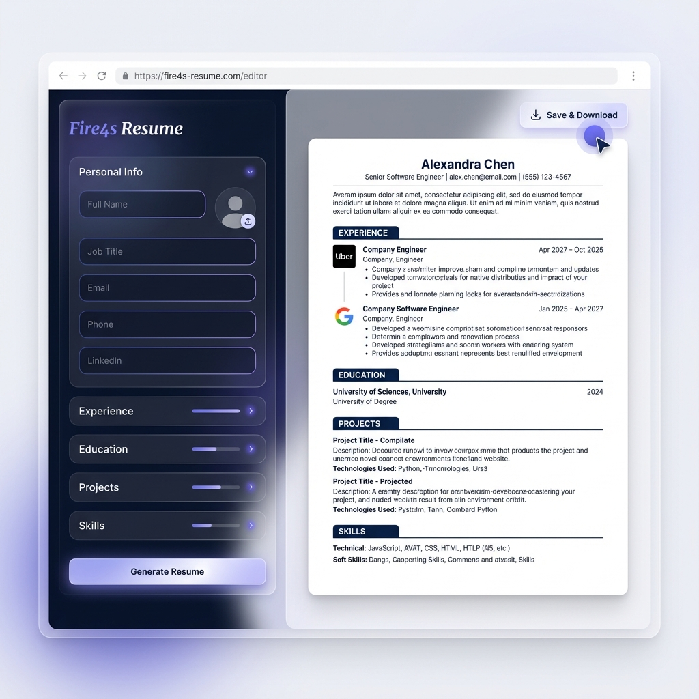

# Fire4s Resume Generator 🔥

A premium, live-previewing resume builder that helps you create professional resumes in seconds. Now featuring high-end glassmorphism design and advanced section management.

## ✨ Premium Features

- **Personalized Branding**: Default identity optimized for **Raphasha**.
- **Recommended Sections**: New **Projects** and **Experience** management for a complete professional profile.
- **Glassmorphism Editor**: A stunning, semi-transparent editor interface with real-time feedback.
- **Micro-Animations**: Smooth entry transitions for dynamic elements.
- **Live Preview**: See your changes instantly on a high-fidelity white A4 template.
- **PDF Export**: Download your finished resume as a high-quality PDF with one click.
- **Section Control**: Add or remove positions, education items, and projects dynamically with unique IDs.

## 🛠️ Built With

- **HTML5 & Vanilla CSS3** (Glassmorphism & Gradients)
- **Vanilla JavaScript** (ES6+ State Management)
- **Vite** (Next-gen frontend Tooling)
- **html2pdf.js** (High-fidelity PDF generation)

## 🚀 Getting Started

1. Navigate to: `cd Fire4s_Resume_Generator`
2. Install: `npm install`
3. Run: `npm run dev`

---
Created by **Raphasha** 💎
